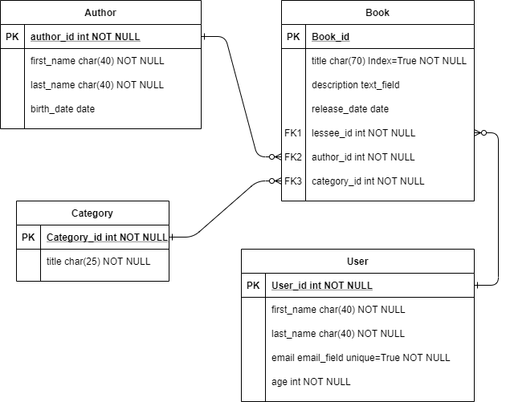

#Django-rest-framework Library

Приложение является api-сервисом, должно хранить информацию о книгах, пользователях,
 которые берут книгу, 
категориях книг и авторов.

Разработано на: **Django** с использованием **Django-rest-framework**

В качестве БД использован SQLite. Для создания моделей и запросов используется встроенная
 в Django ORM.

ER-диаграмма базы данных:

Создано 4 Django-app: 
- author 
- book 
- category 
- user

В данных приложениях созданы модели каждой сущности, написан код для ViewApi, список path(url), 
по которым можно запрашивать или отправлять данные. А также весь код покрыт Unit-тестами.

Разработал: **Саликов Михаил**

Telegram: **@MikhailSalikov**

Email: **misha.salikov@yandex.ru**
